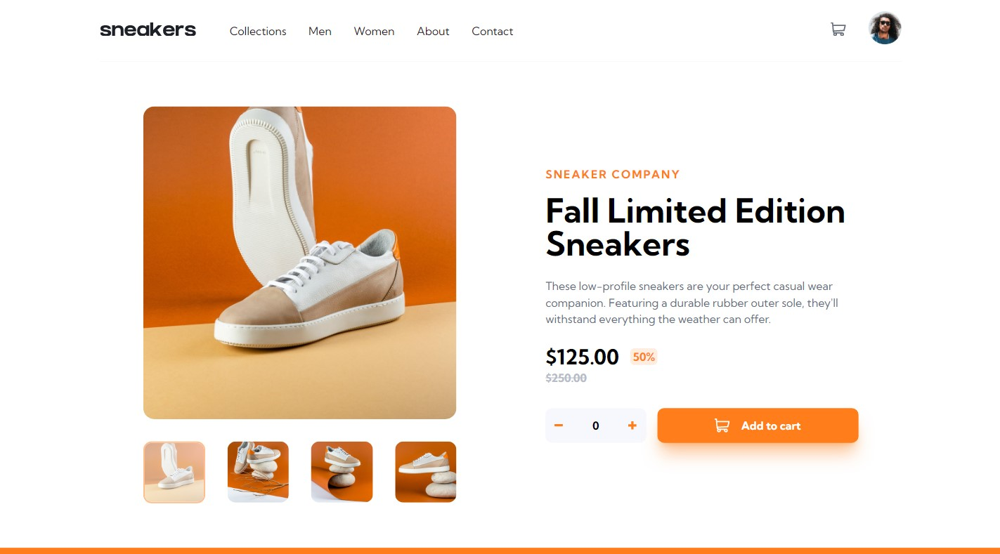

# E-commerce product page solution 📱

This is a solution to the [E-commerce product page challenge on Frontend Mentor](https://www.frontendmentor.io/challenges/ecommerce-product-page-UPsZ9MJp6). Frontend Mentor challenges help you improve your coding skills by building realistic projects.

## Table of contents

- [Overview](#overview-)
  - [The challenge](#the-challenge-)
  - [Screenshot](#screenshot-)
  - [Links](#links-)
- [My process](#my-process-)
  - [Built with](#built-with-)
  - [What I learned](#what-i-learned-)
  - [Continued development](#continued-development-)
  - [Useful resources](#useful-resources-)
- [Author](#author-)
- [Acknowledgments](#acknowledgments-)

## Overview

### The challenge ⚡

Users should be able to:

- View the optimal layout for the site depending on their device's screen size
- See hover states for all interactive elements on the page
- Open a lightbox gallery by clicking on the large product image
- Switch the large product image by clicking on the small thumbnail images
- Add items to the cart
- View the cart and remove items from it

### Screenshot 📷

### Links 🚀

- Solution URL: [Add solution URL here](https://your-solution-url.com)
- Live Site URL: [Add live site URL here](https://your-live-site-url.com)

## My process ⌨

1. First I started thinking and making the HTML structure of the page, from the top to bottom.  
2. Therefore I made the header first, separating between navbar and personal information.  
3. Then I did the main part of the page, separating between product and description. Both are components because I realized they needed to share information between themselves.

### Built with ⚙

- Semantic HTML5 markup
- CSS custom properties
- Flexbox
- TailwindCSS framework
- Sass pre-processor
- Mobile-first workflow
- [React](https://reactjs.org/) - JS library

### What I learned 📚

#### CSS
- Use the order property - flexbox  
- More knowledge about building responsive websites
- Change the color of elements that has been highlighted by the user
#### HTML
- Improvement of my thinking logic in building the website structure right at the beginning of the entire building process  
#### JavaScript
- Create a modal with pure javascript
#### React.js
- To be more used to using components
- Understand how React Contexts work
- Practice with React Hooks

### Continued development 🎯

- Refine my knowledge of create responsive pages
- Improve the use of the React Contexts
- Create modals more easily.

### Useful resources ✨

- [Responsive Viewer](https://chrome.google.com/webstore/detail/responsive-viewer/inmopeiepgfljkpkidclfgbgbmfcennb?hl=en) - This helped me to viewing my page on different screens at once. I really liked this extension and I think you too.

## Author 🙎🏻‍♂️

<!-- - Website - [Add your name here](https://www.your-site.com) -->
- Frontend Mentor - [@yourusername](https://www.frontendmentor.io/profile/yourusername)
- LinkedIn - [Alberto Albuquerque](https://www.linkedin.com/in/albertov-albuquerque/)

## Acknowledgments ⭐

I'm so thankful for [Iuri Silva](https://github.com/iuricode), that helped me a lot with his posts about web programming and some tips related.  
Thank to [SatellaSoft](https://www.youtube.com/watch?v=NXdjf6GJSKo&ab_channel=SatellaSoft) and your channel on YouTube, where I learned how to create a modal with only pure javascript. 

[Back to the 🔝](#frontend-mentor---e-commerce-product-page-solution)
